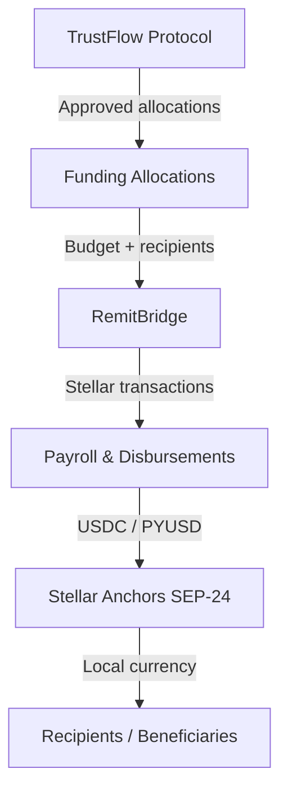
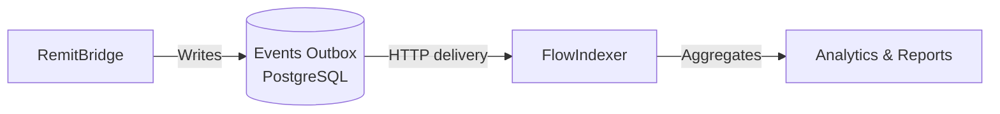

# RemitBridge

**Cross-border payroll and aid disbursement infrastructure built on Stellar.**

[](LICENSE)
[](https://opentrust.dev)
[](https://stellar.org)

---

## Overview

RemitBridge enables organizations to pay employees, contractors, and aid beneficiaries across 170+ countries in seconds at near-zero cost. It is a first-class component of the [OpenTrust Labs](https://opentrust.dev) ecosystem, integrating with **TrustFlow** for trust-gated funding allocations and **FlowIndexer** for real-time analytics and observability.

**Key capabilities:**

- **Global Payroll** — Recurring and scheduled payroll for employees and contractors in any country.
- **Aid Distribution** — NGO program management, beneficiary groups, voucher distributions, and emergency campaigns with budget controls.
- **Stablecoin Settlement** — USDC and PYUSD payments settled on Stellar in seconds.
- **Anchor-based Cash-Out** — SEP-24 Anchor integration for local currency withdrawal in 170+ countries.
- **TrustFlow Integration** — Consume funding allocations and respect trust scores set by the TrustFlow protocol.
- **FlowIndexer Integration** — Every payment action emits structured events consumed by FlowIndexer for analytics, reporting, and cross-ecosystem observability.
- **Compliance Layer** — Modular KYC, AML, sanctions screening, and risk scoring.
- **Multi-sig Approvals** — Configurable approval thresholds before large disbursements execute.

---

## Architecture

### Payment Flow



### Event Flow



### System Components

```mermaid
graph TB
    subgraph Frontend
        UI[React / Vite / Tailwind]
    end

    subgraph Backend
        API[Express REST API]
        AUTH[JWT Auth]
        RATE[Rate Limiter]
        
        subgraph Routes
            OR[/orgs]
            RC[/recipients]
            BA[/batches]
            PY[/payroll]
            AI[/aid]
            CO[/compliance]
            ANA[/analytics]
            TFR[/trustflow]
            WH[/webhooks]
        end

        subgraph Integrations
            TFA[TrustFlow Adapter]
            EV[Event Publisher]
        end

        subgraph Services
            ST[Stellar Service]
            CS[Compliance Service]
        end
    end

    subgraph Storage
        PG[(PostgreSQL)]
        OB[(Events Outbox)]
    end

    subgraph External
        HZ[Stellar Horizon]
        TF[TrustFlow API]
        FIP[FlowIndexer API]
    end

    subgraph Contracts
        SC[Soroban Compliance\nContract]
    end

    UI --> API
    API --> AUTH
    API --> RATE
    API --> Routes
    Routes --> Services
    Routes --> Integrations
    Services --> PG
    Services --> HZ
    Integrations --> TF
    EV --> OB
    OB -->|Background| FIP
    ST --> SC
```

---

## Features

| Feature | Status |
|---------|--------|
| Batch payment disbursements | ✅ |
| Recurring / scheduled payroll | ✅ |
| Multi-signature batch approvals | ✅ |
| Department / contractor payrolls | ✅ |
| NGO aid program management | ✅ |
| Beneficiary groups | ✅ |
| Emergency aid campaigns | ✅ |
| Budget tracking per program | ✅ |
| KYC / AML compliance records | ✅ |
| Sanctions screening hooks | ✅ |
| TrustFlow allocation consumption | ✅ |
| TrustFlow webhook receiver | ✅ |
| FlowIndexer event publishing | ✅ |
| Analytics endpoints | ✅ |
| Anchor SEP-24 simulation | ✅ |
| CSV bulk recipient import | ✅ |
| Soft-delete recipients | ✅ |
| Paginated list endpoints | ✅ |
| Rate limiting | ✅ |
| Audit trail with export | ✅ |
| Soroban compliance contract | ✅ |
| Clawback (48h window) | ✅ |
| Health check endpoint | ✅ |
| Anchor SEP-24 live integration | 🔜 |
| Webhook signature verification | 🔜 |
| Redis-backed rate limiting | 🔜 |
| Job queue for batch submission | 🔜 |

---

## Ecosystem

RemitBridge is part of the [OpenTrust Labs](https://opentrust.dev) ecosystem:

### TrustFlow Integration

TrustFlow is the trust-based funding coordination protocol. RemitBridge integrates at two levels:

1. **Funding Allocations** — Pull approved funding allocations from TrustFlow and use them as the budget source for disbursements. When a batch executes, the allocation is marked consumed in TrustFlow.
2. **Trust Score Gating** — Optionally require a minimum trust score before org can disburse.
3. **Approved Recipients** — Import TrustFlow-approved recipient lists directly into batches.
4. **Webhooks** — Receive real-time funding events from TrustFlow (`allocation.approved`, `stream.updated`).

```javascript
// Link your org to TrustFlow
PATCH /api/trustflow/link
{ "trustflow_org_id": "tf-org-123" }

// Sync and view allocations
GET /api/trustflow/allocations

// Consume an allocation for a batch
POST /api/trustflow/allocations/:id/consume
{ "amount": 5000, "batch_id": 42 }
```

### FlowIndexer Integration

FlowIndexer provides analytics and observability for the entire OpenTrust ecosystem. RemitBridge uses the **transactional outbox pattern** to guarantee at-least-once delivery of all events.

**Events emitted:**

| Event | Trigger |
|-------|---------|
| `remitbridge.payroll.created` | Batch created |
| `remitbridge.payroll.executed` | Batch settled on Stellar |
| `remitbridge.transfer.settled` | Individual payment success |
| `remitbridge.transfer.failed` | Individual payment failure |
| `remitbridge.transfer.clawback` | Admin clawback recorded |
| `remitbridge.beneficiary.created` | Recipient added |
| `remitbridge.compliance.check_completed` | KYC/AML check recorded |
| `remitbridge.compliance.sanctions_match` | Sanctions screening hit |
| `remitbridge.aid.program_created` | NGO program created |
| `remitbridge.trustflow.allocation_consumed` | Allocation used for batch |
| `remitbridge.org.created` | New org registered |

### OpenTrust SDK Compatibility

RemitBridge APIs are designed for future exposure via the OpenTrust SDK:

```javascript
// Future SDK usage
const client = new OpenTrustClient({ apiKey: '...' });

await client.remitbridge.createPayroll({ payments, currency });
await client.remitbridge.getTransfers({ batchId });
await client.remitbridge.getBeneficiary(recipientId);
await client.remitbridge.getSettlement(batchId);
await client.remitbridge.aidPrograms.create({ name, country, budget });
await client.remitbridge.analytics.summary();
```

---

## API Documentation

See [API.md](API.md) for the full API reference.

**Base URL:** `http://localhost:4000/api`

### Authentication

All endpoints (except `/api/health`, `/api/orgs/signup`, `/api/orgs/login`, `/api/webhooks/*`) require a `Bearer` JWT token:

```
Authorization: Bearer <token>
```

### Key Endpoints

| Method | Path | Description |
|--------|------|-------------|
| POST | `/api/orgs/signup` | Register organization |
| POST | `/api/orgs/login` | Login |
| GET | `/api/health` | Health check |
| POST | `/api/batches` | Create disbursement batch |
| POST | `/api/batches/:id/submit` | Submit to Stellar |
| GET | `/api/recipients` | List recipients (paginated) |
| POST | `/api/recipients/csv` | Bulk CSV import |
| POST | `/api/payroll/schedules` | Create recurring payroll |
| POST | `/api/payroll/batches/:id/approve` | Approve payroll batch |
| GET | `/api/aid/programs` | List aid programs |
| POST | `/api/aid/programs/:id/disburse` | Disburse to beneficiary group |
| GET | `/api/analytics/summary` | Overall statistics |
| GET | `/api/analytics/volume` | Volume over time |
| POST | `/api/compliance/checks` | Record compliance check |
| GET | `/api/compliance/recipients/:id/status` | Compliance status |
| GET | `/api/trustflow/allocations` | Cached TrustFlow allocations |
| POST | `/api/webhooks/trustflow` | TrustFlow webhook receiver |

---

## Development

### Prerequisites

- Node.js 20+
- Docker & Docker Compose
- (Optional) Rust + `soroban-cli` for contract work

### Quick Start

```bash
git clone https://github.com/opentrust-labs/remitbridge.git
cd remitbridge

# Start Postgres and backend
cp .env.example .env
docker compose up postgres -d
cd backend && npm install && npm run dev
```

### Environment Variables

| Variable | Required | Description |
|----------|----------|-------------|
| `DATABASE_URL` | ✅ | PostgreSQL connection string |
| `JWT_SECRET` | ✅ | JWT signing secret (min 32 chars) |
| `PORT` | | Backend port (default: 4000) |
| `CORS_ORIGINS` | | Comma-separated allowed origins |
| `STELLAR_NETWORK` | | `mainnet` or (default) testnet |
| `TRUSTFLOW_API_URL` | | TrustFlow API base URL |
| `TRUSTFLOW_API_KEY` | | TrustFlow API key |
| `TRUSTFLOW_WEBHOOK_SECRET` | | Webhook signature secret |
| `FLOW_INDEXER_URL` | | FlowIndexer API base URL |
| `FLOW_INDEXER_API_KEY` | | FlowIndexer API key |
| `MINIMUM_TRUST_SCORE` | | Min trust score for disbursements (default: 30) |

### Running Tests

```bash
cd backend
npm test                        # Run all tests
npm test -- --coverage         # With coverage report
npm test -- tests/stellar.test.js  # Single test file
```

### Frontend

```bash
cd frontend
npm install
npm run dev   # http://localhost:5173
```

---

## Deployment

### Docker Compose (Production-like)

```bash
cp .env.example .env
# Edit .env with real credentials
docker compose up --build
```

### Manual

1. Deploy PostgreSQL (Supabase, Neon, RDS, etc.)
2. Set all required environment variables
3. Run `npm install && npm start` in `backend/`
4. Build frontend: `cd frontend && npm run build` — deploy `dist/` to CDN

### Smart Contracts

The Soroban compliance contract (`contracts/compliance/`) records disbursements on-chain for immutable auditability.

```bash
cd contracts/compliance
cargo test                    # Run contract tests
soroban contract build        # Build WASM
soroban contract deploy ...   # Deploy to Stellar
```

---

## Roadmap

See [ROADMAP.md](ROADMAP.md) for the full roadmap.

**Near-term (Q3 2026)**
- SEP-24 live Anchor integration (replace simulation)
- Redis-backed rate limiting for horizontal scaling
- Job queue for Stellar batch submission (Bull/pg-boss)
- Webhook signature verification (HMAC-SHA256)

**Medium-term (Q4 2026)**
- OpenTrust SDK client package
- Multi-currency support beyond USDC/PYUSD
- Recurring payroll auto-execution engine
- Real-time push notifications (WebSockets)

**Long-term (2027)**
- Soroban contract wired to backend batch flow
- Cross-border FX rate oracle integration
- Mobile SDK for beneficiary self-service

---

## Contributing

See [CONTRIBUTING.md](CONTRIBUTING.md).

We welcome contributions of all kinds: bug reports, feature requests, code, documentation, and testing.

**Good first issues** are tagged [`good first issue`](https://github.com/opentrust-labs/remitbridge/issues?q=is:issue+label:good+first+issue) on GitHub.

---

## Security

Please report security vulnerabilities privately. See [SECURITY.md](SECURITY.md).

---

## License

MIT © OpenTrust Labs
